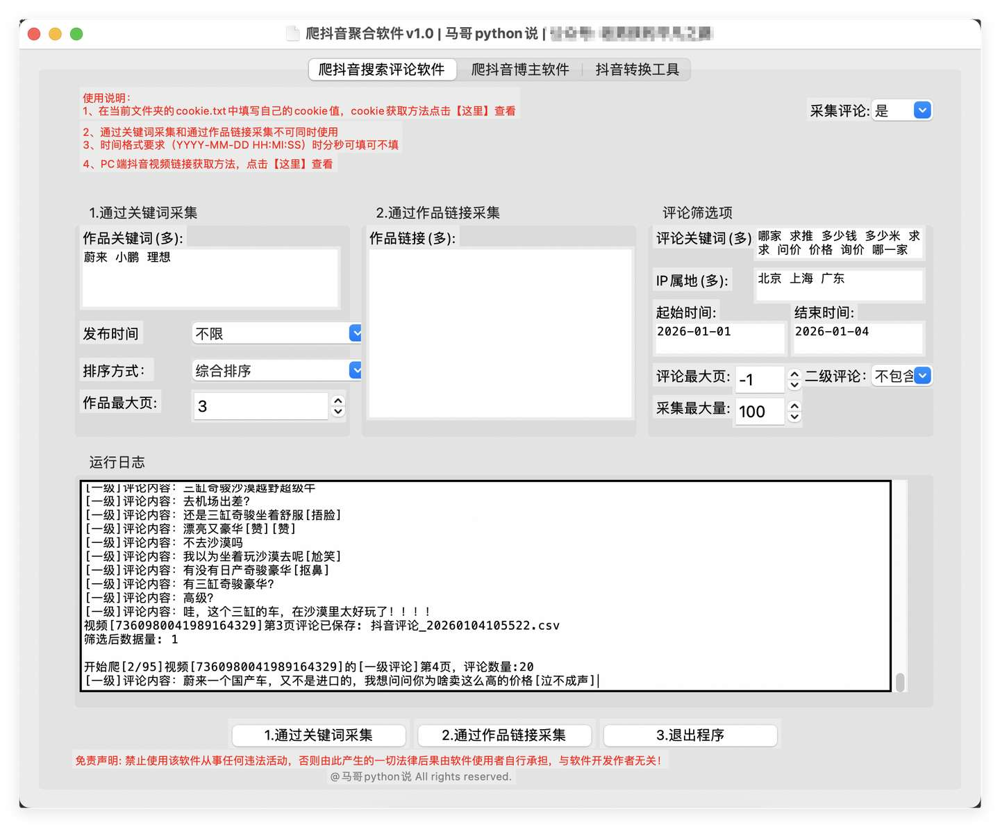
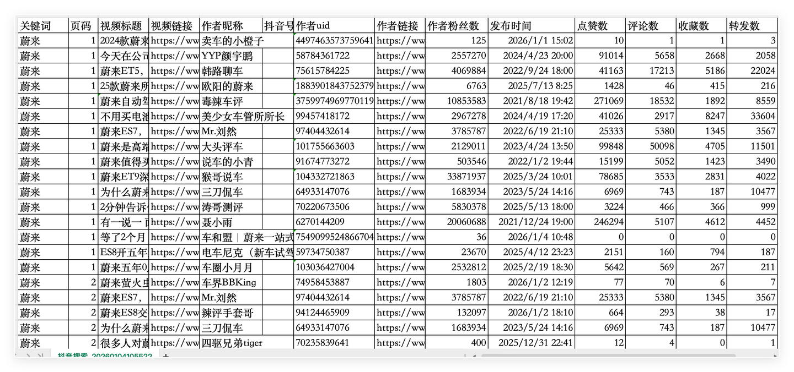
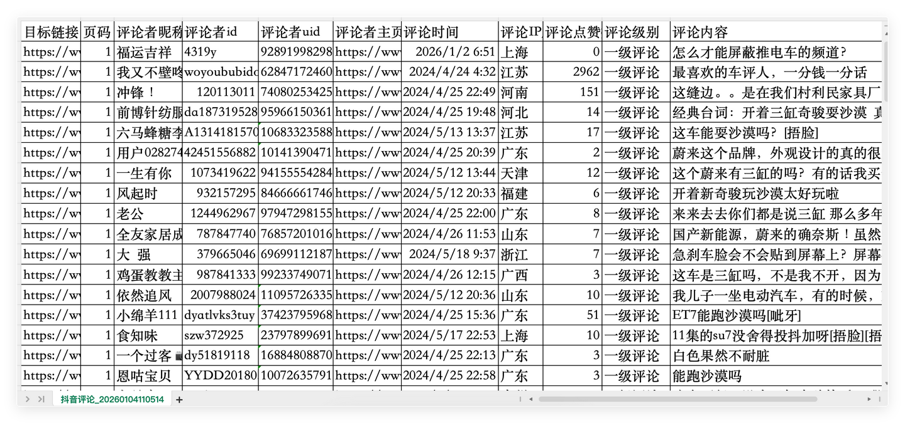
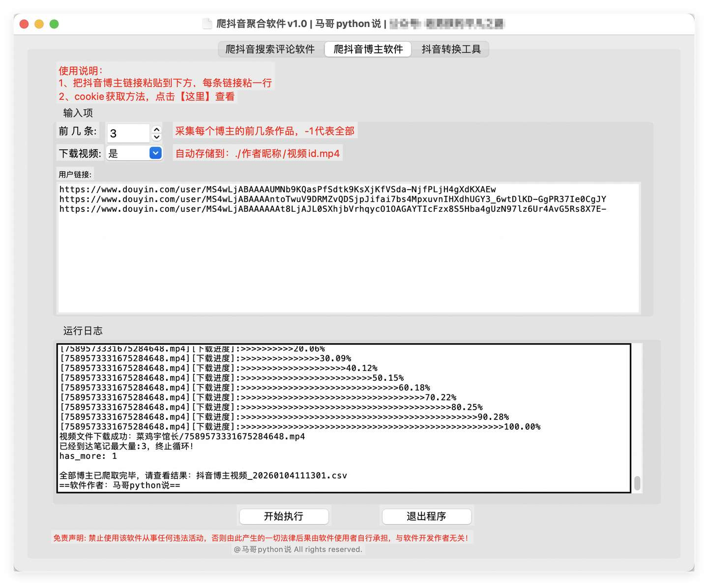
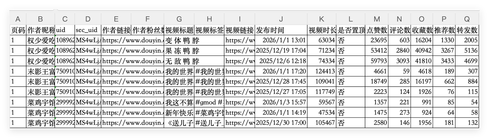
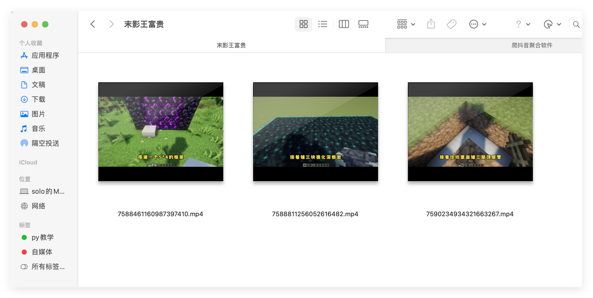
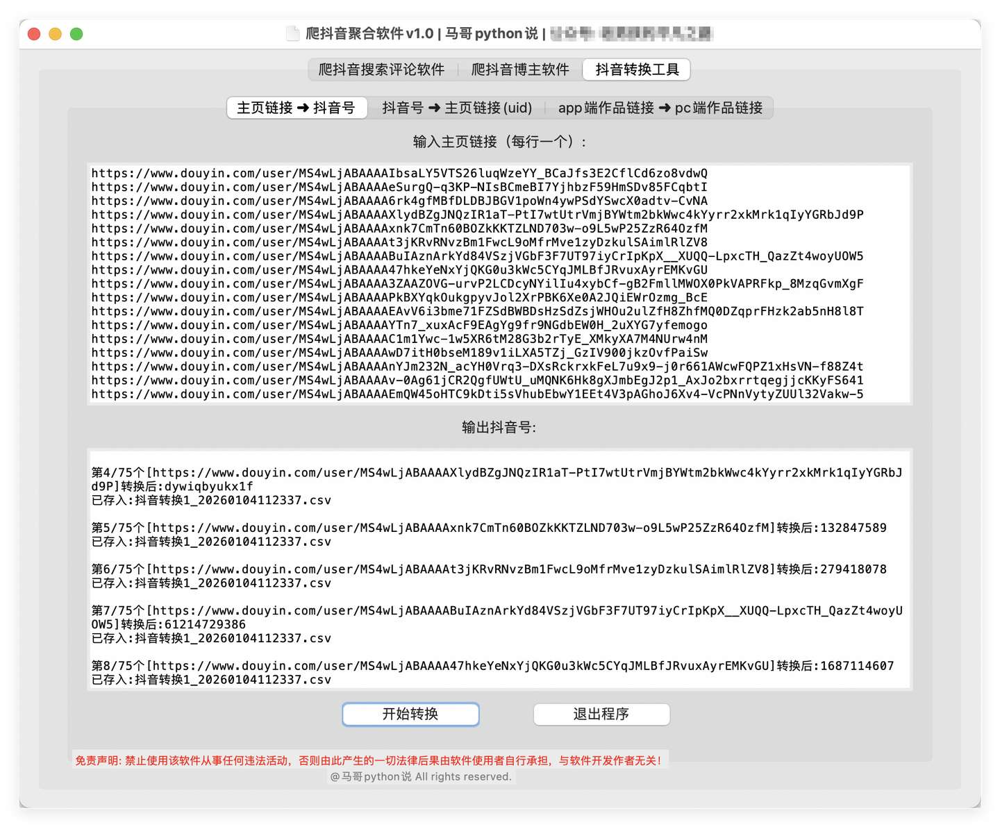
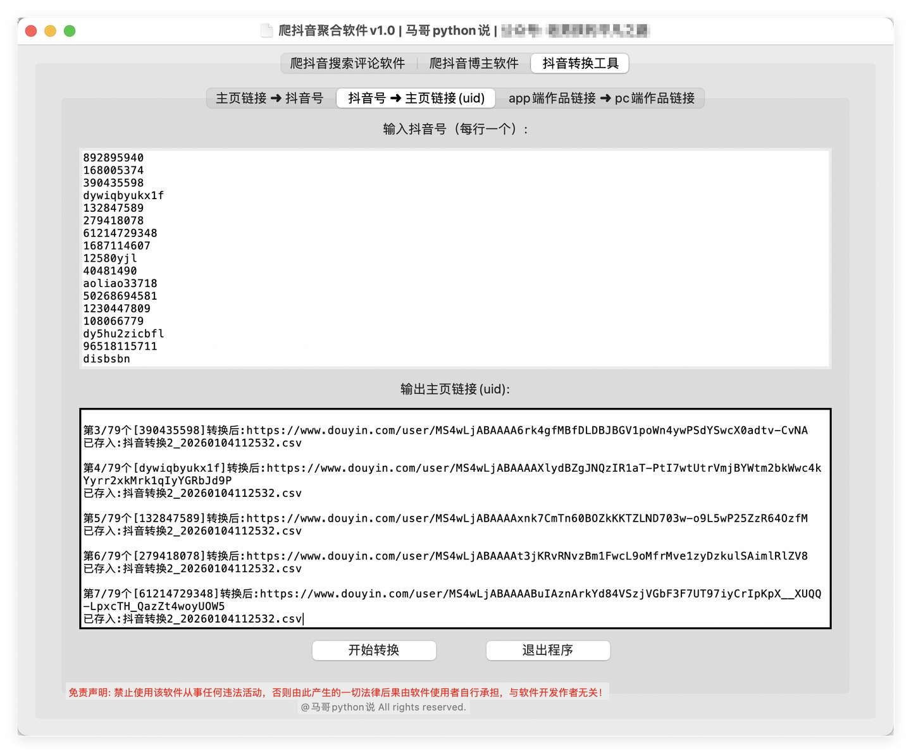
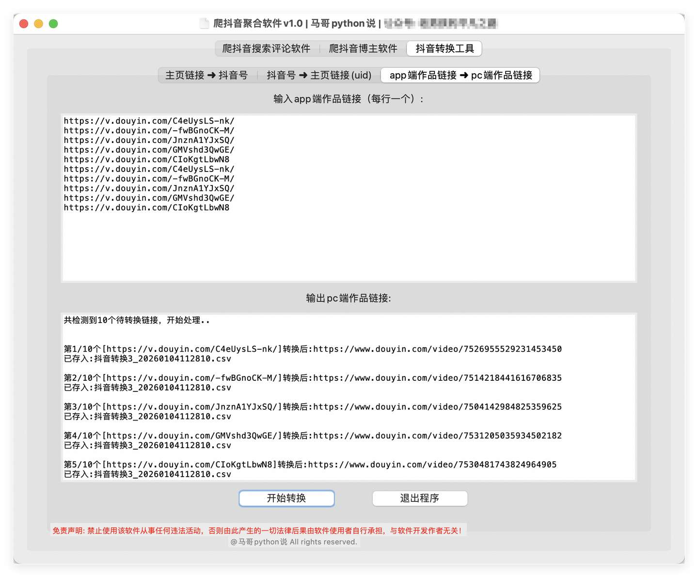

# douyin_one_spider

   

> 🔥 Douyin all-in-one data collection software: a ready-to-use GUI tool for keyword-based video collection, comment collection, creator profile video collection, and link / uid conversion.

[⬇️ Download Latest Release](https://github.com/mashukui/douyin_one_spider/releases/) | [🎬 Video Demo](https://www.bilibili.com/video/BV1tkiZBiEyn/) | [🏠Homepage](https://mashukui.github.io/douyin_one_spider/) | [💳 Purchase Access](https://mgnb.pro/product/douyin)

This repository is used for software introduction, release distribution, usage documentation, and issue feedback. The complete source code is not publicly available for copyright reasons. You can download the Windows / macOS client from Releases.

  <a href="README.md">简体中文 README</a> | <a href="README.en.md">English README</a>

## 👋 Overview

`douyin_one_spider` is a desktop GUI tool designed for Douyin data collection scenarios. It combines comment collection, creator profile video collection, and link conversion into one client. Users do not need to install or configure a Python environment. Download the client, log in, and start using it.

It is suitable for the following scenarios:

| Scenario | Description |
| --- | --- |
| ✅ Lead generation | Collect potential leads from comments under industry, brand, or competitor-related videos |
| ✅ Public opinion analysis | Collect keyword-related videos and comments for topic tracking and communication analysis |
| ✅ Content research | Analyze high-quality creators, interaction data, and content topics |
| ✅ Douyin operations | Convert profile links, Douyin IDs, uids, and video links between different formats |

## ⚙️ Features

| Feature | Description | Output |
| --- | --- | --- |
| ✅ Keyword video collection | Search Douyin videos by keyword and collect basic video data | CSV |
| ✅ Comment collection | Collect comments from keyword search results or specified video links | CSV |
| ✅ Creator profile video collection | Collect video lists from creator profile links | CSV, video files |
| ✅ Link and uid conversion | Convert between profile links, Douyin IDs, uids, and video links | GUI result |
| ✅ Incremental saving | Save data to CSV after each page to reduce data loss caused by interruptions | CSV |
| ✅ Runtime logs | Record runtime logs for troubleshooting | `logs` files |

## 🚀 Quick Start

1. Open [Releases](https://github.com/mashukui/douyin_one_spider/releases/) and download the latest version.
2. Extract the package and run the client for your operating system.
3. Use the built-in cookie helper to configure your cookie.
4. Log in to the software account (no account yet? [Day pass from 19 CNY, instant activation](#-pricing)).
5. Select a collection module and enter a keyword, video link, or profile link.
6. Click "Start" and wait for the collection task to finish.
7. Check the CSV files, downloaded videos, and log files in the software directory.

## 💻 Supported Platforms

| Platform | Support |
| --- | --- |
| Windows | Supported. Download and run the Windows client |
| macOS | Supported. Download and run the macOS client |
| Python environment | Not required for end users |

## 🖼️ Screenshots

### Keyword Video and Comment Collection

Comment collection interface:

Collected video data:

Collected comment data:

### Creator Profile Video Collection

Profile video collection interface:

Profile video collection result:

Automatically downloaded video files:

### Link and uid Conversion

Convert a profile link to a Douyin ID:

Convert a Douyin ID to a profile link:

Convert a mobile app video link to a PC video link:

## 📊 Output Fields

The software generates different CSV files based on the selected collection module. Since there are many fields, the main field groups are shown first. You can expand the sections below to view the full field lists.

### Search Video Data

- Collection info: keyword, page
- Video info: video title, video link, published time
- Author info: author nickname, author uid, author profile link, author followers
- Interaction data: likes, comments, favorites, shares

View full search video fields

Keyword, page, video title, video link, author nickname, author uid, author link, author followers, published time, likes, comments, favorites, shares

### Comment Data

- Collection info: target link, page
- Commenter info: commenter nickname, commenter ID, commenter uid, commenter profile link
- Comment info: comment time, comment IP location, comment likes, comment level, comment content

View full comment fields

Target link, page, commenter nickname, commenter ID, commenter uid, commenter profile link, comment time, comment IP location, comment likes, comment level, comment content

### Creator Profile Video Data

- Collection info: page
- Author info: author nickname, uid, sec_uid, author profile link, author followers
- Video info: video title, video tags, video link, published time, video duration, pinned status
- Interaction data: likes, comments, favorites, recommendations, shares

View full creator profile video fields

Page, author nickname, uid, sec_uid, author link, author followers, video title, video tags, video link, published time, video duration, pinned status, likes, comments, favorites, recommendations, shares

## 🛠️ Technical Notes

The software is developed in Python. Core modules include:

| Module | Purpose |
| --- | --- |
| tkinter | GUI interface |
| browser automation | Data reading via system browser |
| json | Response parsing |
| pandas | CSV export |
| logging | Runtime logging |

The software collects data through the user's system browser (manual cookie configuration is no longer needed since v1.8a2). During collection, results are saved by page by default. The request interval is usually about 1-2 seconds, which helps control the collection pace and reduce data loss caused by unexpected interruptions.

## 💰 Pricing

| Plan | Duration | Price | Recommended Usage |
| --- | --- | --- | --- |
| Day pass | 1 day | 19 CNY | Trial use or small one-time tasks |
| Monthly pass | 1 month | 149 CNY | Short-term collection needs |
| Quarterly pass | 3 months | 349 CNY | Medium-term collection needs |
| Yearly pass | 1 year | 799 CNY | Long-term stable use |

Purchase page: [https://mgnb.pro/product/douyin](https://mgnb.pro/product/douyin)

## 🔐 License and Activation Rules

- The software uses account and password login (a phone number and password are provided after purchase). One account can only be used on one computer.
- Only one software instance is allowed on a single computer. Multiple concurrent instances are not supported.
- The software is maintained by the author, and future versions will be published through GitHub Releases.

## 🕒 Changelog

| Version | Date | Notes |
|---|---|---|
| v1.8a5 | 2026-09-06 | Added retry mechanism for profile video collection; fixed black screen in ID-to-profile-link conversion; improved prompts |
| v1.8a2 | 2026-08-31 | Removed manual cookie configuration — cookies are now read automatically via the system browser; reduced client size |
| v1.7 | 2026-07-31 | Improved search captcha handling; added image download for image posts; added log deduplication; new fields for link conversion |
| v1.6 | 2026-04-19 | Fixed video download failures; optimized request mechanism |
| v1.5 | 2026-04-07 | Added detail collection with watermark-free video download (batch supported); switched to session-based requests |

> For the full release history, see [Releases](https://github.com/mashukui/douyin_one_spider/releases)

## ❓ FAQ

### Can I use the software after changing computers or reinstalling the system?

Yes. Activation is bound to one computer per account. To switch devices, contact the [WeChat official account 老男孩的平凡之路](https://github.com/mashukui/mashukui/blob/main/wechat2.png) and request unbinding; after that you can log in on the new computer.

### Do I need to purchase again for software updates?

No. During the license period, all future versions are freely available on [GitHub Releases](https://github.com/mashukui/douyin_one_spider/releases). Just download the latest version and reinstall.

### Do I need to install Python?

No. The software is packaged as a desktop client. Download the version for your operating system and run it directly.

### What is the cookie used for?

The cookie allows the software to access platform data under your current account session. Please use your own account cookie and keep related files secure.

### Will collected data be lost if the task is interrupted?

The software saves CSV files by page instead of waiting until the whole task is complete. If the task is interrupted, data from completed pages is usually still preserved in the result files.

### Where are result files saved?

By default, result files are saved in the software directory. Log files are saved in the `logs` directory.

### How much data can it collect?

The actual amount of data depends on the keyword, account status, platform API response, network environment, and collection frequency. It is recommended to set a reasonable collection range and request interval.

### What should I do if an error occurs?

Check the log files under the `logs` directory first. When reporting an issue, please provide:

- Software version
- Operating system
- Feature module used
- Keyword, profile link, or video link entered
- Error screenshot
- Log content around the time when the error occurred

## ⚠️ Compliance Statement

This software is intended only for lawful data analysis, learning, research, and authorized business scenarios. Users are responsible for complying with the target platform's terms of service, privacy policy, and applicable laws and regulations.

Do not use this software for:

- High-frequency, malicious, or destructive requests
- Unauthorized collection, distribution, or sale of sensitive personal information
- Activities that infringe the lawful rights of platforms, creators, or users
- Any other behavior that violates laws, regulations, or platform rules

Users are solely responsible for risks and liabilities caused by improper use.

## 📦 Get the Software

- GitHub Releases: [https://github.com/mashukui/douyin_one_spider/releases/](https://github.com/mashukui/douyin_one_spider/releases/)
- WeChat official account: `老男孩的平凡之路`
- Reply in the WeChat official account: `抖音`

---

More collection tools (Douyin / Xiaohongshu / Weibo / PGY / YouTube, 7 in total): <a href="https://mgnb.pro">马哥数据采集工坊 (mgnb.pro)</a>

